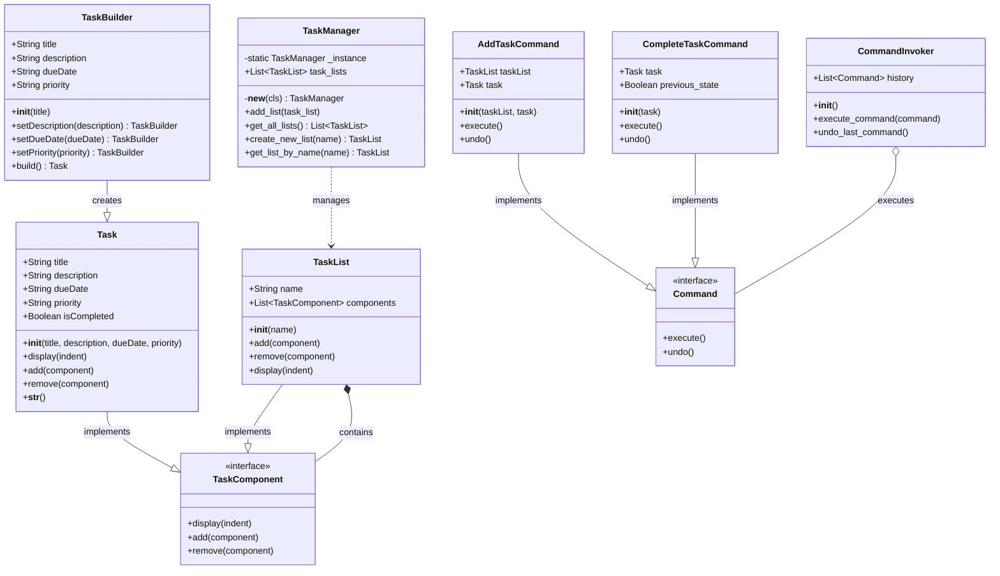

# Administrador de Tareas con Patrones de Diseño

Este proyecto implementa un sencillo administrador de tareas utilizando varios patrones de diseño para organizar y gestionar las funcionalidades de manera eficiente.

## Patrones de Diseño Implementados

### 1. Patrón Creacional: Builder

* **Descripción del Problema de Diseño:**
    * Al principio, la creación de objetos `Task` involucraba un constructor con varios parámetros opcionales (descripción, fecha de vencimiento, prioridad). Esto hacía que la creación de nuevas tareas con diferentes combinaciones de atributos fuera menos legible y más propensa a errores, especialmente si algunos parámetros no eran relevantes para ciertas tareas. Además, si en el futuro se agregaban más atributos a la clase `Task`, el constructor se volvería aún más complejo.

* **Razón por la cual se eligió el patrón Builder:**
    * El patrón Builder se eligió para separar la construcción de un objeto complejo de su representación. Esto permite crear diferentes representaciones de un objeto utilizando el mismo proceso de construcción. En este caso, facilita la creación de objetos `Task` con solo los atributos necesarios de una manera más fluida y legible. También ofrece flexibilidad para futuras extensiones de la clase `Task` sin necesidad de modificar constructores existentes.

* **Cómo se solucionó el problema después de implementar dicho patrón:**
    * Después de implementar el patrón Builder con la clase `TaskBuilder`, la creación de tareas se realiza mediante una interfaz fluida (method chaining). Ahora se pueden crear objetos `Task` especificando solo los atributos relevantes mediante llamadas a métodos `set_...()`, terminando con el método `build()` para obtener la instancia final de `Task`. Esto mejora significativamente la legibilidad y la flexibilidad en la creación de tareas.

### 2. Patrón Estructural: Composite

* **Descripción del Problema de Diseño:**
    * La necesidad de representar tanto tareas individuales como grupos de tareas (listas de tareas) y tratarlas de manera uniforme surgió como un requisito natural del administrador. Queríamos poder agregar tareas a listas, mostrar todas las tareas (incluyendo las que están dentro de las listas) y potencialmente aplicar operaciones a grupos de tareas de la misma manera que a tareas individuales.

* **Razón por la cual se eligió el patrón Composite:**
    * El patrón Composite permite construir estructuras de objetos en árbol que representan jerarquías parte-todo. Permite que los clientes traten objetos individuales y composiciones de objetos de manera uniforme. Esto encajaba perfectamente con la necesidad de tener tanto tareas individuales como listas de tareas que pudieran contener otras tareas o incluso otras listas.

* **Cómo se solucionó el problema después de implementar dicho patrón:**
    * Se definió una interfaz `TaskComponent` con métodos comunes como `display()`, `add()` y `remove()`. Las clases `Task` (hoja) y `TaskList` (contenedor) implementaron esta interfaz. `TaskList` puede contener instancias de `Task` u otras `TaskList`, creando así una estructura jerárquica. El método `display()` en `TaskList` itera a través de sus componentes, llamando al método `display()` de cada uno, lo que permite mostrar toda la estructura de tareas de manera uniforme.

### 3. Patrón de Comportamiento: Command

* **Descripción del Problema de Diseño:**
    * Se identificó la necesidad de encapsular las acciones como objetos para poder parametrizarlas, encolarlas, registrarlas y soportar operaciones como deshacer (undo). Por ejemplo, agregar una tarea, completar una tarea o eliminar una tarea son acciones distintas que podrían necesitar ser revertidas.

* **Razón por la cual se eligió el patrón Command:**
    * El patrón Command convierte una solicitud en un objeto que contiene toda la información sobre la solicitud. Esta encapsulación permite pasar comandos como argumentos, ponerlos en cola, registrarlos para deshacer/rehacer, etc. Esto proporciona un nivel de indirección entre el objeto que invoca la operación y el objeto que conoce cómo realizarla.

* **Cómo se solucionó el problema después de implementar dicho patrón:**
    * Se definió una interfaz `Command` con métodos `execute()` y `undo()`. Para cada acción (agregar tarea, completar tarea), se creó una clase de comando concreta (`AddTaskCommand`, `CompleteTaskCommand`) que implementa la interfaz `Command`. Un `CommandInvoker` se encarga de ejecutar los comandos y mantener un historial para la funcionalidad de deshacer.

### 4. Patrón Creacional: Singleton

* **Descripción del Problema de Diseño:**
    * Se consideró que la gestión centralizada de las listas de tareas podría beneficiarse de tener una única instancia de un administrador que contuviera todas las listas principales. Esto evitaría la creación de múltiples instancias del administrador y facilitaría el acceso a las listas desde diferentes partes de la aplicación.

* **Razón por la cual se eligió el patrón Singleton:**
    * El patrón Singleton asegura que una clase tenga solo una instancia y proporciona un punto de acceso global a ella. En este caso, se implementó en la clase `TaskManager` para garantizar que solo haya una instancia responsable de mantener y gestionar las listas de tareas principales.

* **Cómo se solucionó el problema después de implementar dicho patrón:**
    * La clase `TaskManager` implementó el patrón Singleton utilizando el método `__new__` para controlar la creación de instancias. Si no existe una instancia, se crea una; de lo contrario, se devuelve la instancia existente. Esto asegura que cualquier parte del programa que necesite acceder al administrador de tareas obtenga la misma instancia.

## Diagrama de Clases UML

